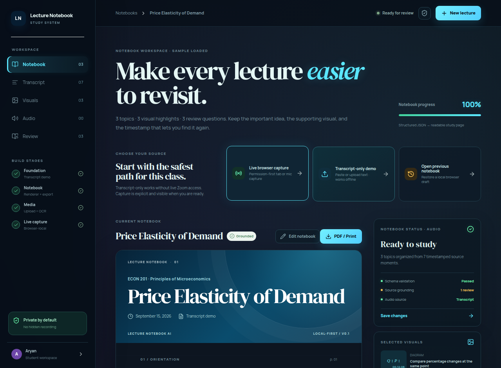
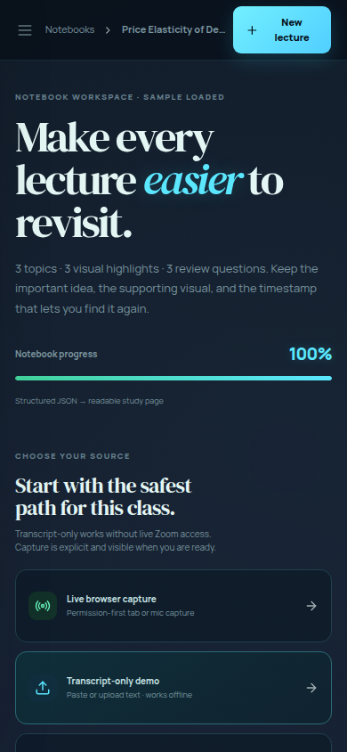

# Lecture Notebook AI

<p align="center"></p>

<p align="center"></p>

**Lecture Notebook AI** is a privacy-first, transcript-centered study workspace for turning lectures into structured, reviewable notes. It combines timestamped transcripts, notebook rendering, visual highlights, browser-local media processing, and PDF-ready export in a dark neon academic interface.


## Features

- Transcript-only workflow that works without live meeting access.
- Structured lecture notebook output with orientation, objectives, topics, definitions, formulas, common mistakes, worked examples, revision notes, and review questions.
- Searchable timestamped transcript with speaker labels and source grounding.
- Workspace navigation for Notebook, Transcript, Visuals, Audio, and Review.
- Editable notebook content with local save and reset controls.
- Markdown, HTML, JSON, and browser print-to-PDF export.
- Browser-local IndexedDB persistence for notebooks and media metadata.
- Consent-first screen and microphone capture using browser MediaRecorder APIs.
- Chrome speech-recognition support through SpeechRecognition and webkitSpeechRecognition when available.
- Video frame extraction through a canvas-based capture flow.
- Image OCR through native TextDetector when available, with a Tesseract.js browser fallback.
- Duplicate visual filtering and frame-importance scoring utilities.
- Stage 5 media review timeline with **All**, **Needs review**, and **Kept** filters.
- Per-asset approval controls so captured frames and uploaded visuals can be reviewed before study export.
- Language selection for browser speech recognition and Tesseract.js OCR in English, Hindi, Spanish, and French.
- Optional Chrome extension with a popup launcher and an unobtrusive page shortcut.

## Screenshots

### Desktop workspace



### Responsive mobile workspace



## Privacy and safety

The app does not join Zoom, bypass waiting rooms, defeat CAPTCHAs, hide recording state, or bypass host controls. Capture starts only after the consent checklist and browser permission flow. The browser build keeps workspace data local using localStorage and IndexedDB. Media is not uploaded by the static frontend.

The Chrome extension requests `storage` and `activeTab` permissions. Its content script adds a small `LN` shortcut to pages; clicking it opens the Lecture Notebook AI workspace. It does not read page content or automatically capture tabs.

## Open the web app

[Open the deployed Lecture Notebook AI workspace](https://lecturenoteb-hxgiwwjj.manus.space/)

## Install the Chrome extension with Load unpacked

Chrome does not install a local extension by opening a ZIP directly. The ZIP contains the extension source, and Chrome’s developer mode uses the **extracted folder**.

1. Download `lecture-notebook-ai-extension.zip` from the web app’s **Chrome extension** action or from this repository’s release/download files.
2. Extract the ZIP into a normal folder. On Windows, right-click the ZIP and choose **Extract All**. On macOS, double-click it. On Linux, use your archive manager or `unzip`.
3. Open Chrome and navigate to `chrome://extensions`.
4. Turn on **Developer mode** in the upper-right corner.
5. Click **Load unpacked**.
6. Select the extracted folder that directly contains `manifest.json`, `popup.html`, `popup.js`, and `content.js`. Do not select the ZIP file and do not select a parent folder containing the extracted folder.
7. Pin **Lecture Notebook AI** from Chrome’s extensions menu for quick access.
8. Click the extension icon and choose **Open workspace**, or use the small `LN` shortcut added to ordinary webpages.

### Updating the extension during development

After changing extension files, return to `chrome://extensions` and click the extension’s **Reload** button. If you changed the manifest, reload the extension and refresh any open tabs.

### Removing the extension

Open `chrome://extensions`, find **Lecture Notebook AI**, and click **Remove**. Removing the extension does not delete the notebook data stored by the website; use the app’s **Delete local data** action separately if you want to clear the workspace.

## Local development

Requirements: Node.js 22+ and pnpm.

```bash
pnpm install
pnpm dev
pnpm test
pnpm run check
pnpm run build
```

## Use the GitHub repository

Clone the repository with GitHub CLI:

```bash
gh repo clone XenogenesisXtreme/lecture-notebook-ai-mvp
cd lecture-notebook-ai-mvp
pnpm install
pnpm dev
```

Or clone it with Git:

```bash
git clone https://github.com/XenogenesisXtreme/lecture-notebook-ai-mvp.git
cd lecture-notebook-ai-mvp
pnpm install
```

After making changes, run the checks and push them to the `main` branch:

```bash
pnpm test
pnpm run check
pnpm run build
git add .
git commit -m "Describe the change"
git push origin main
```

The repository is maintained by **Xenogenesis Xtreme** (`@XenogenesisXtreme`). To make future commits display your GitHub identity, configure your local repository with the name and a GitHub-associated email address:

```bash
git config user.name "Xenogenesis Xtreme"
git config user.email "YOUR_GITHUB_EMAIL_OR_NO_REPLY_EMAIL"
```

The repository owner and public maintainer identity are controlled by the GitHub account, while individual commit authors are controlled by the Git author configuration. Existing commits retain their original author metadata; new commits will use the identity configured above.

The extension files are in `extension/`. To recreate the downloadable archive locally:

```bash
rm -f client/public/lecture-notebook-ai-extension.zip
cd extension && zip -r ../client/public/lecture-notebook-ai-extension.zip manifest.json popup.html popup.js content.js icons
```

## Project structure

```text
client/src/pages/Home.tsx       Main workspace UI and browser flows
client/src/lib/lecture.ts       Lecture schema, notebook generation, and exports
client/src/lib/media.ts         Media classification, OCR, capture, persistence, and frames
client/src/lib/media.test.ts    Media utility tests
extension/                      MV3 Chrome extension source and icons
brand/                          Repository banner, logo, and product screenshots
STAGE3.md                       Stage 3 implementation notes
STAGE4.md                       Stage 4 implementation notes
STAGE5.md                       Stage 5 media review notes
```

## Current limitations

Speech recognition and screen capture vary by browser and operating system. Tesseract.js provides local OCR but may be slower on large images. The current extension is a launcher and page shortcut; it does not yet inject transcript controls into video-conferencing applications. For production distribution, add a privacy policy URL and Chrome Web Store metadata.

## License

MIT
